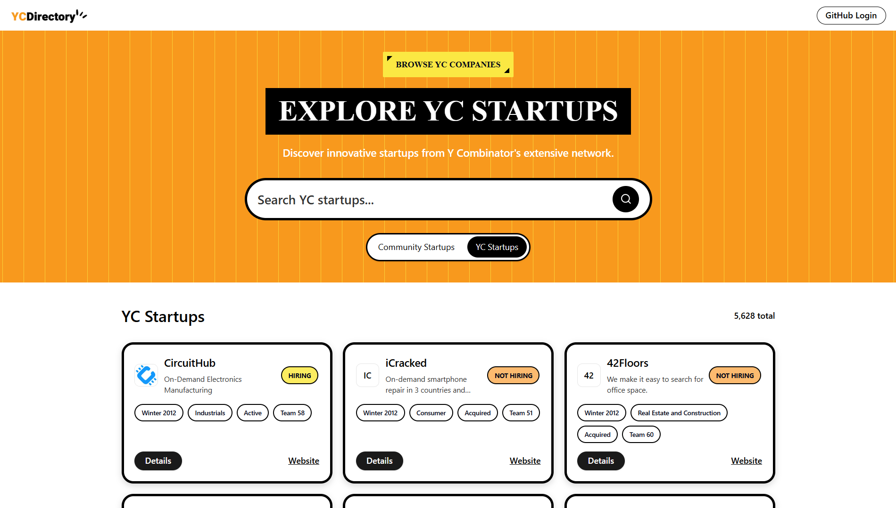
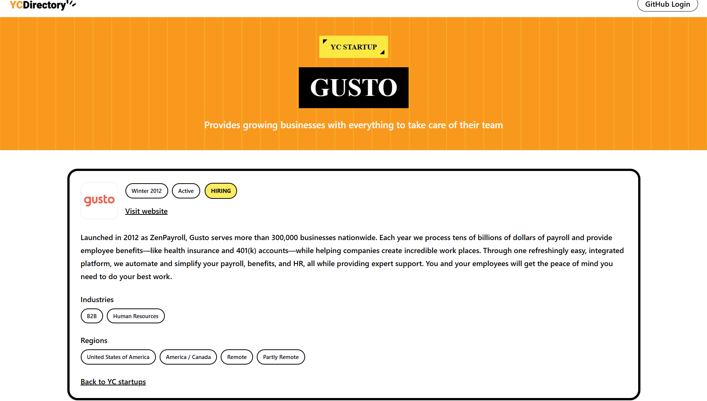
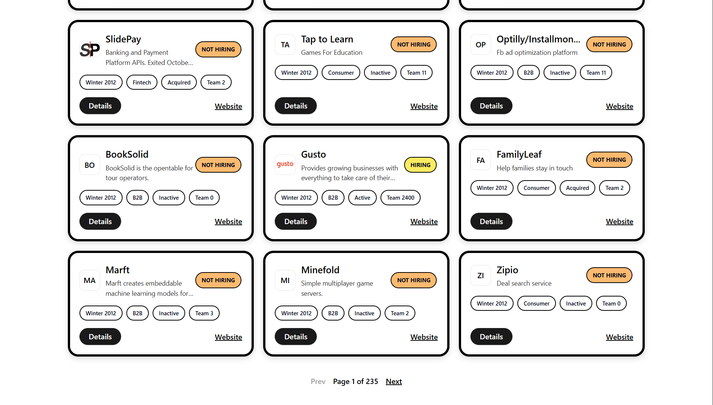
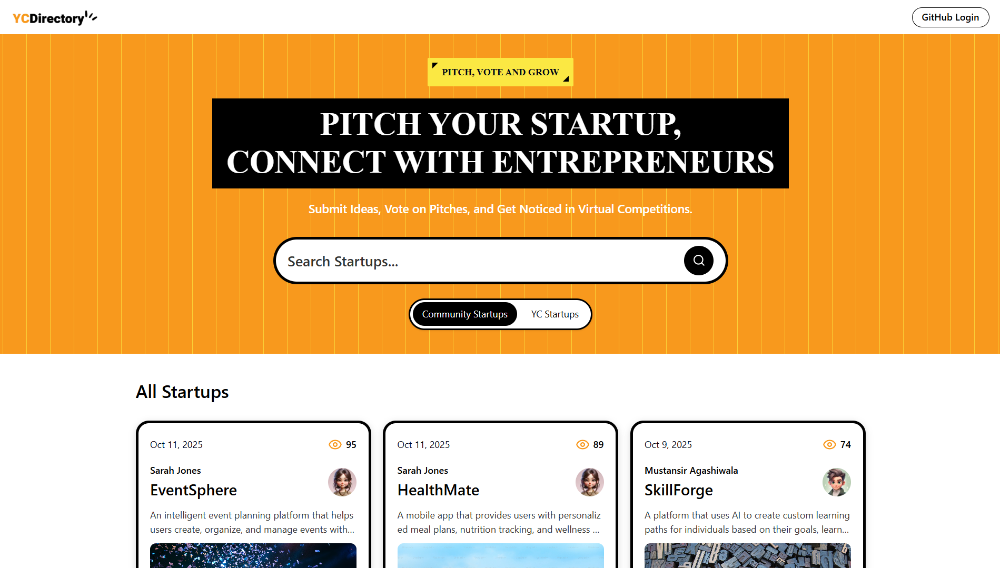

# YC Directory

A sleek **YC-style startup directory** built with **Next.js (App Router)** and **TypeScript**, featuring Markdown-based startup pitches, user profiles, and a clean Tailwind UI. Powered by **Sanity CMS** for content management and **NextAuth** for secure authentication — designed for speed, simplicity, and modern UX.

## Highlights

- 🏗️ Public directory to **add, browse, and view startups** with Markdown-supported pitches.
- 👤 **User profile pages** displaying startups owned or associated with each user.
- ⚙️ **Sanity CMS** for flexible, real-time content management.
- 🔐 **NextAuth** integration for seamless and secure user authentication.
- ⚡ **React Suspense** + **Server Components** for fast loading and skeleton placeholders.
- 🎨 **Tailwind CSS** + **github-markdown-css** for responsive and polished UI styling.

---

## 🧠 Tech Stack

**Next.js · TypeScript · Sanity · NextAuth · Tailwind CSS · markdown-it · github-markdown-css**

### YC startups (MongoDB)

This project can import YC company data (5000+ companies) from:
`https://yc-oss.github.io/api/companies/all.json`

created an import script (stores data in MongoDB; the app reads from MongoDB afterwards):
`npm run seed:yc`

3. Browse YC startups:

- Home toggle: **Community Startups** vs **YC Startups**
- YC list page: `/yc`

## 🌐 Live Demo

👉 [startup-directory-drab.vercel.app](https://startup-directory-drab.vercel.app/)

## Screenshots

